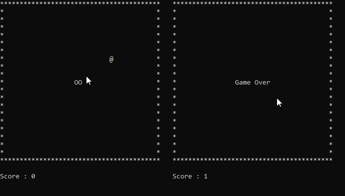
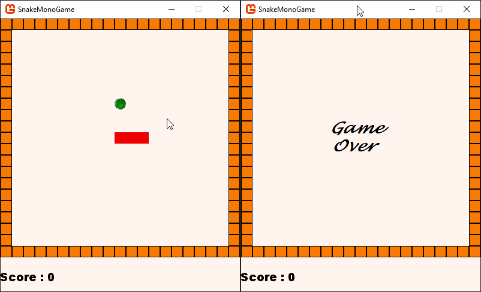

# Snake Game (Console/MonoGame)

Two implementations of the game Snake:
- Console version on .NET Console;
- Graphical version on MonoGame.

Control with: '⬅️'; '⬆️'; '⬇️'; '➡️'.

Testing: This is a project with game snake implementation on Console/MonoGame.

## Console 

## MonoGame 

This project was initially made using
- Visual Studio 2022
- .NET 9.0
- MonoGame.Framework 3.8.1
- xUnit
